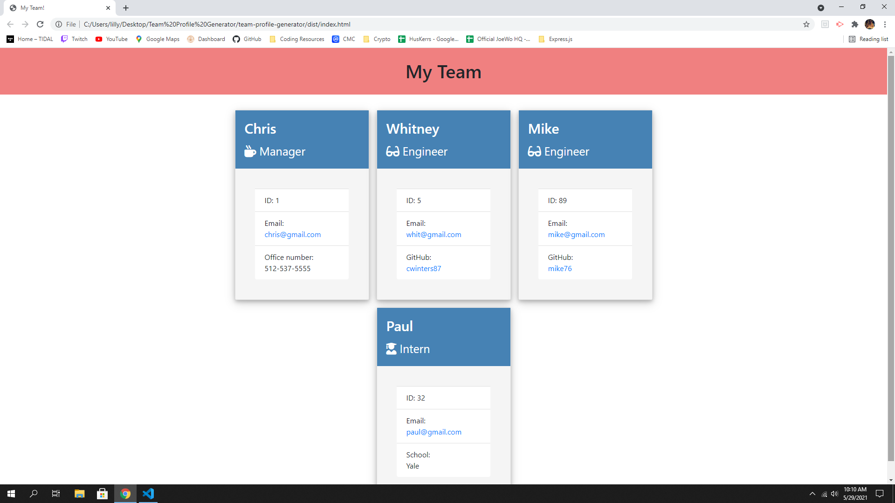

  <h1 align="center">Team Profile Generator!</h1>

## Description
Organize and keep track of your current team by answering just a few questions
## Table of Contents
- [Description](#description)
- [Installation](#installation)
- [Usage](#usage)
- [Demo](#demo)
- [Tests](#tests)
- [Questions](#questions)
## Installation
💾 npm i
## Usage
💻 Helps keep your team contact and info in a simple window on your browswer.
## Demo

Click link below to see a working demo:
https://drive.google.com/file/d/1-IJ51c4_fBSEBcWIkRoUFNnayaB472cr/view?usp=sharing

## Contributing
👪 Chris Winters
## Tests
✏️ npm run test
## Questions
🙋‍♂️ Email or reach me on my GitHub  
 
:octocat: Find me on GitHub: [cwinters87](https://github.com/cwinters87) 
 
✉️ Email me with any questions: taylor314@gmail.com  
🌟This README was generated by Chris Winters using the [readme-generator](https://github.com/cwinters87/readme-generator)
